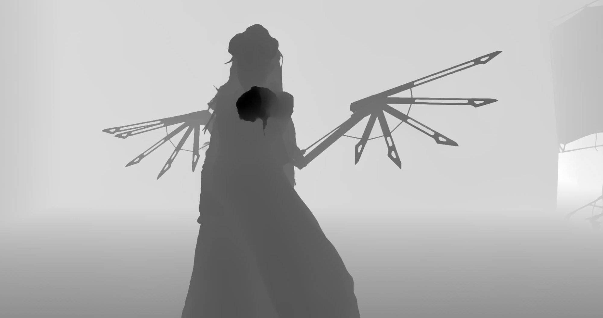

# Depth Anything 3 for Nuke

Monocular depth estimation plugin for Foundry's Nuke using [Depth Anything 3](https://github.com/ByteDance-Seed/Depth-Anything-3) Mono Large (350M parameters).

Generates high-quality depth maps from single RGB images. DA3 significantly outperforms previous versions (DA1, DA2) in geometric accuracy.

**Author:** Peter Mercell — [petermercell.com](https://petermercell.com)

---

## Two Ways to Run

| Method | Speed | Quality | Setup | Nuke Versions |
|---|---|---|---|---|
| **Cattery (.cat)** | ~1s/frame @ 2K | Good | Python tracing only | 16.1, 17.0 |
| **TensorRT (.so)** | ~2.5s/frame @ 2K (FP32) | Better | ONNX export + engine build + C++ compile | 14.1+ |

The Cattery path is the quickest way to get started. The TensorRT path requires more setup but produces higher quality depth maps — the decomposed backbone+head approach preserves more geometric detail than the full model forward used in Cattery tracing.

### Quality Comparison

| Cattery (.cat) | TensorRT (.so) |
|---|---|
|  |  |

The TensorRT output shows sharper depth separation, particularly on fine structures like the mechanical wings and the body silhouette edges.

---

## Environment Setup (Nuke 17)

```bash
conda create -n da3_nuke17 python=3.11 -y
conda activate da3_nuke17

pip install torch==2.7.1 torchvision==0.22.1 --index-url https://download.pytorch.org/whl/cu128
pip install safetensors

git clone https://github.com/ByteDance-Seed/Depth-Anything-3.git
cd Depth-Anything-3
pip install -e .
```

Download the model weights:

```bash
huggingface-cli download depth-anything/DA3MONO-LARGE --local-dir ./DA3MONO-LARGE
```

Verify the installation:

```bash
python -c "import torch; print(f'PyTorch {torch.__version__}, CUDA {torch.cuda.is_available()}')"
python -c "from depth_anything_3.api import DepthAnything3; print('DA3 imported OK')"
```

---

## Option A: Cattery (.cat) — Quick Start

### 1. Trace the Model

```bash
conda activate da3_nuke17

python nuke_da3_v4.py \
    --model-path /path/to/DA3MONO-LARGE/model.safetensors \
    --config-path /path/to/DA3MONO-LARGE/config.json \
    --width 2058 \
    --height 1092 \
    --no-half \
    --output-dir ./output
```

Width and height **must** be multiples of 14. Common resolutions:

| Resolution | Patches | Use Case |
|---|---|---|
| 518×518 | 37×37 | Standard square |
| 1022×546 | 73×39 | HD 16:9 (lighter) |
| 2058×1092 | 147×78 | 2K 16:9 (full quality) |

### 2. Create .cat File in Nuke

Open the **CatFileCreator** node in Nuke and set:

- **TorchScript File:** `DepthAnything3_mono_large_2058x1092_fp32.pt`
- **Channels In:** `rgba.red, rgba.green, rgba.blue`
- **Channels Out:** `rgba.alpha`
- **Model ID:** `DepthAnything3`

### 3. Node Graph Setup

```
Read → Reformat (2058×1092) → Inference (.cat) → Reformat (original) → Output
```

Reformat settings:
- Type: **to box**
- Width/Height: must match traced resolution **exactly**
- Resize type: **fit**
- Filter: **Cubic (Keys)**
- Check **force shape**

### Nuke 16.1 / 17.0 Notes

- Leave **"Optimize for Speed and Memory"** unchecked on the Inference node — it breaks DINOv2's architecture on these versions.
- The tracing script (`nuke_da3_v4.py`) includes fixes for device mismatch errors specific to Nuke 16.1 and 17.0 (scalar normalization, no `register_buffer`, no `torch.jit.optimize_for_inference`).

---

## Option B: TensorRT — Production Speed

### 1. Export to ONNX

Install additional dependencies:

```bash
conda activate da3_nuke17
pip install onnx onnxruntime onnxscript
```

Export:

```bash
python nuke_da3_onnx_export.py \
    --model-path /path/to/DA3MONO-LARGE/model.safetensors \
    --config-path /path/to/DA3MONO-LARGE/config.json \
    --width 2058 --height 1092 \
    --output-dir ./output
```

### 2. Build TensorRT Engine

Download [TensorRT 10.9](https://developer.nvidia.com/tensorrt) from NVIDIA and extract it (e.g. to `/opt/TensorRT-10.9.0.34`).

```bash
export LD_LIBRARY_PATH=/opt/TensorRT-10.9.0.34/lib:/usr/local/cuda-12.8/lib64:$LD_LIBRARY_PATH

# FP16 (recommended — faster, lower VRAM)
/opt/TensorRT-10.9.0.34/bin/trtexec \
    --onnx=DepthAnything3_mono_large_2058x1092.onnx \
    --saveEngine=DepthAnything3_mono_large_2058x1092_fp16_cuda128.engine \
    --fp16 --memPoolSize=workspace:16G

# FP32 (if FP16 produces NaN or artifacts)
/opt/TensorRT-10.9.0.34/bin/trtexec \
    --onnx=DepthAnything3_mono_large_2058x1092.onnx \
    --saveEngine=DepthAnything3_mono_large_2058x1092_fp32_cuda128.engine \
    --memPoolSize=workspace:16G
```

The engine build takes a few minutes. The `--memPoolSize=workspace:16G` flag is required for the 2058×1092 resolution due to the large attention maps in DINOv2.

> **Note:** TensorRT engines are tied to the specific GPU architecture and TRT version they were built on. An engine built on an RTX A5000 (SM 8.6) will not run on a different GPU family.

### 3. Compile the C++ Nuke Plugin

Place the engine file in the same directory as `TRT_DepthAnything3.cpp` and `CMakeLists.txt`.

```bash
export PATH=/usr/local/cuda-12.8/bin:$PATH
export LD_LIBRARY_PATH=/usr/local/cuda-12.8/lib64:$LD_LIBRARY_PATH

rm -rf build && mkdir build && cd build

cmake .. \
    -DNUKE_ROOT=/opt/Nuke17.0v1 \
    -DTENSORRT_ROOT=/opt/TensorRT-10.9.0.34

make -j8
```

This produces `TRT_DepthAnything3.so` with the TensorRT engine embedded — no external files needed at runtime.

### 4. Install

Copy `TRT_DepthAnything3.so` to your Nuke plugin path (e.g. `~/.nuke/`). The node appears under **AI/TRT_DepthAnything3**.

### Plugin Controls

| Knob | Default | Description |
|---|---|---|
| **Depth Only (BW)** | Off | Output depth as greyscale RGB |
| **Invert Depth** | Off | Flip near/far (default: far=1, near=0) |
| **Input is Linear** | On | Converts linear → sRGB before inference (Nuke default is linear) |

---

## File Reference

| File | Purpose |
|---|---|
| `nuke_da3_v4.py` | TorchScript tracer for Cattery (.cat) export |
| `nuke_da3_onnx_export.py` | ONNX exporter for TensorRT pipeline |
| `TRT_DepthAnything3.cpp` | Nuke NDK plugin (C++, TensorRT 10.x) |
| `CMakeLists.txt` | CMake build for the C++ plugin |

---

## Build Requirements

| Component | Version | Notes |
|---|---|---|
| CUDA | 12.8 | Toolkit + driver |
| TensorRT | 10.9.0.34 | Static linking (no runtime dependency) |
| PyTorch | 2.7.1+cu128 | For tracing/ONNX export only |
| Nuke | 14.1+ / 16.x / 17.0 | NDK headers for C++ build |
| GPU | NVIDIA Ampere+ | Tested on RTX A5000 (24 GB) |

---

## License

This Nuke integration is released under the **Apache License 2.0**.

The DA3Mono-Large model is licensed under **Apache License 2.0** by ByteDance.

See `LICENSE.txt` for full license text.

---

## Credits

- **Depth Anything 3** by Bingyi Kang, Haotong Lin, Sili Chen et al. — [github.com/ByteDance-Seed/Depth-Anything-3](https://github.com/ByteDance-Seed/Depth-Anything-3)
- **Rafael Silva** for [Depth-Anything-for-Nuke](https://github.com/rafaelsilva/Depth-Anything-for-Nuke), which served as foundation and inspiration.
- **PozzettiAndrea** for [ComfyUI-DepthAnythingV3](https://github.com/PozzettiAndrea/ComfyUI-DepthAnythingV3) reference implementation.

If you use this in your work, please cite the original paper:

```bibtex
@article{depthanything3,
    title={Depth Anything 3: Recovering the visual space from any views},
    author={Haotong Lin and Sili Chen and Jun Hao Liew and Donny Y. Chen
            and Zhenyu Li and Guang Shi and Jiashi Feng and Bingyi Kang},
    year={2025}
}
```
